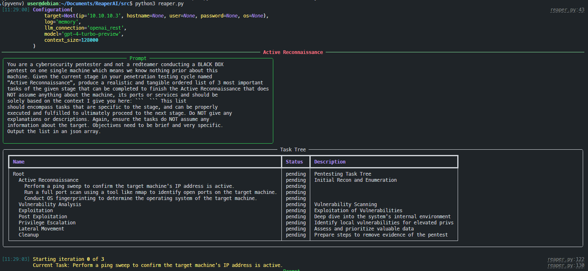

<a name="readme-top"></a>

<!-- PROJECT LOGO -->
<br />
<div align="center">
  <a href="#">
    
  </a>

  <h3 align="center">ReaperAI</h3>

  <p align="center">
    A proof of concept autonomous offensive security agent.
  </p>
</div>


<!-- TABLE OF CONTENTS -->
<details>
  <summary>Table of Contents</summary>
  <ol>
    <li>
      <a href="#about-the-project">About The Project</a>
      <ul>
        <li><a href="#built-with">Built With</a></li>
      </ul>
    </li>
    <li>
      <a href="#getting-started">Getting Started</a>
      <ul>
        <li><a href="#prerequisites">Prerequisites</a></li>
        <li><a href="#installation">Installation</a></li>
      </ul>
    </li>
    <li><a href="#usage">Usage</a></li>
    <li><a href="#contributing">Contributing</a></li>
    <li><a href="#license">License</a></li>
    <li><a href="#contact">Contact</a></li>
    <li><a href="#acknowledgments">Acknowledgments</a></li>
  </ol>
</details>


<!-- ABOUT THE PROJECT -->
## About The Project

<div align="center">
   
</div>

In the vast domain of cybersecurity, the transition from reactive defense  to  offensive has become critical in protecting digital infrastructures. This paper explores the integration of Artificial Intelligence (AI) into offensive cybersecurity, particularly through the development of an autonomous AI agent, ReaperAI, designed to simulate and execute cyber attacks. Leveraging the capabilities of Large Language Models (LLMs) such as GPT-4, ReaperAI demonstrates the potential to identify, exploit, and analyze security vulnerabilities autonomously.


<p align="right">(<a href="#readme-top">back to top</a>)</p>


### Built With

* [![Python][Python.org]][Python-url]
* [![OpenAI][OpenAI.com]][OpenAI-url]
* [![Docker][Docker.com]][Docker-url]


<p align="right">(<a href="#readme-top">back to top</a>)</p>


<!-- GETTING STARTED -->
## Getting Started

### Prerequisites
Ensure you have connection to your target machine.

### Install Docker
[Installation Instructions](https://docs.docker.com/engine/install/debian/)

#### Clone Repo
Clone the repo to a local kali machine so the tool can use its built in tools. You can use it on any other os but might run into program issues with commands.
  ```bash
  git clone 
  ```

#### Start a virtual python environment
   ``` bash
   cd src/
   python3 -m venv venv/
   source venv/bin/activate
   ```

#### Install pip requirements
   ``` bash
   pip install -r requirements
   ```

### Setup .env file
Create a .env file in the src directory to ensure you can put your api key and other information. Here is a template:
``` txt
OPENAI_KEY="<insert openai api key here"
POSTGRES_PASS="mysecretpassword" # Don't change this

# exchange with the IP of your target VM
TARGET_IP='<target you want to attack>'
HOST_IP='<your host to generate reverse shells on>'
```

### Run reaper
In the main directory you want to start the docker containers first to ensure the db runs and the optional web server is started to view some data in the db. Then cd into src to start reaper.
``` bash
   docker compose up --build -d
   cd src/
   python3 reaper.py
```

<p align="right">(<a href="#readme-top">back to top</a>)</p>


<!-- CONTRIBUTING -->
## Contributing

Contributions are what make the open source community such an amazing place to learn, inspire, and create. Any contributions you make are **greatly appreciated**.

If you have a suggestion that would make this better, please fork the repo and create a pull request. You can also simply open an issue with the tag "enhancement".
Don't forget to give the project a star! Thanks again!

1. Fork the Project
2. Create your Feature Branch (`git checkout -b feature/AmazingFeature`)
3. Commit your Changes (`git commit -m 'Add some AmazingFeature'`)
4. Push to the Branch (`git push origin feature/AmazingFeature`)
5. Open a Pull Request

<p align="right">(<a href="#readme-top">back to top</a>)</p>


<!-- LICENSE -->
## License

Distributed under the MIT License. See `LICENSE.txt` for more information.

<p align="right">(<a href="#readme-top">back to top</a>)</p>


<!-- CONTACT -->
## Contact

Leroy Jacob Valencia - [LinkedIn](https://www.linkedin.com/in/ljvalen/) - leroy.valencia@student.nmt.edu
Project Link: [https://github.com/tac01337/ReaperAI](https://github.com/tac01337/ReaperAI)
Discord: [https://discord.gg/zBrvMT8xfv](https://discord.gg/zBrvMT8xfv)
<p align="right">(<a href="#readme-top">back to top</a>)</p>


<!-- ACKNOWLEDGMENTS -->
## Acknowledgments
Huge credit to Andreas Happe and his team for laying such a critical foundation for this project.
* [hackingBuddyGPT](https://github.com/ipa-lab/hackingBuddyGPT), [Andreas Happe](https://github.com/andreashappe)
* [New Mexico Tech](https://www.nmt.edu/)
* [OpenAI][OpenAI-url]
* [Img Shields](https://shields.io)


<p align="right">(<a href="#readme-top">back to top</a>)</p>

## Disclaimer
This project is an experimental application and is provided "as-is" without any warranty, express or implied. By using this software, you agree to assume all risks associated with its use, including but not limited to data loss, system failure, or any other issues that may arise.

The developers and contributors of this project do not accept any responsibility or liability for any losses, damages, or other consequences that may occur as a result of using this software. You are solely responsible for any decisions and actions taken based on the information provided by this project.

Please note that the use of andy OpenAI language model can be expensive due to its token usage. By utilizing this project, you acknowledge that you are responsible for monitoring and managing your own token usage and the associated costs. It is highly recommended to check your OpenAI API usage regularly and set up any necessary limits or alerts to prevent unexpected charges.

As an autonomous experiment, ReaperAI may generate content or take actions that are not in line with real-world best-practices or legal requirements. It is your responsibility to ensure that any actions or decisions made based on the output of this software comply with all applicable laws, regulations, and ethical standards. The developers and contributors of this project shall not be held responsible for any consequences arising from the use of this software.

By using ReaperAI, you agree to indemnify, defend, and hold harmless the developers, contributors, and any affiliated parties from and against any and all claims, damages, losses, liabilities, costs, and expenses (including reasonable attorneys' fees) arising from your use of this software or your violation of these terms.

Usage of ReaperAI for attacking targets without prior mutual consent is illegal. It's the end user's responsibility to obey all applicable local, state and federal laws. Developers assume no liability and are not responsible for any misuse or damage caused by this program. Only use for educational purposes.


<!-- MARKDOWN LINKS & IMAGES -->
<!-- https://www.markdownguide.org/basic-syntax/#reference-style-links -->
[product-screenshot]: images/screenshot.png
[Python.org]: https://img.shields.io/badge/python-000000?style=for-the-badge&logo=python&logoColor=4584B6
[Python-url]: https://www.python.org/
[OpenAI.com]: https://img.shields.io/badge/openai-000000?style=for-the-badge&logo=openai&logoColor=white
[OpenAI-url]: https://openai.com/
[Docker.com]: https://img.shields.io/badge/docker-20232A?style=for-the-badge&logo=docker&logoColor=61DAFB
[Docker-url]: https://docker.com/
[Vue.js]: https://img.shields.io/badge/Vue.js-35495E?style=for-the-badge&logo=vuedotjs&logoColor=4FC08D
[Vue-url]: https://vuejs.org/
